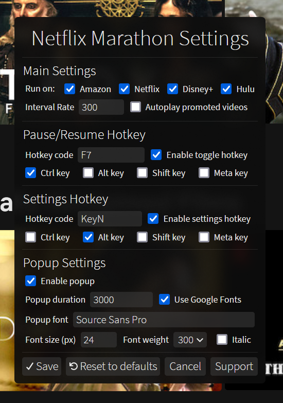

  <h1 align="center">
    <a href="https://greasyfork.org/en/scripts/420475-netflix-marathon-pausable"> 
      <b>Netflix Marathon (Pausable)</b></a> 
  <b>Install:&nbsp;&nbsp;<a href="https://cdn.jsdelivr.net/gh/aminomancer/Netflix-Marathon-Pausable@latest/marathon.user.js">jsDelivr</a>&nbsp;or&nbsp;<a href="https://greasyfork.org/en/scripts/420475-netflix-marathon-pausable">Greasy Fork</a></b>
  </h1>

A configurable userscript that automatically skips recaps, intros, credits, and ads, and clicks "next episode" prompts on Netflix, Amazon Prime Video, and Disney+. Requires a userscript manager like [Violentmonkey](https://violentmonkey.github.io/) or [Tampermonkey](https://www.tampermonkey.net/). Greasemonkey is fully supported too, but not recommended. If I get any requests I'll consider turning it into a webextension addon.

This script works by querying the document for elements that skip through the video. Normally it does this constantly, even when you might want to watch the credits or something. So I thought it'd be nice to add a toggle to disable/enable the searching, on the fly, without needing to reload the website. By default, the hotkey is Ctrl+F7. It pauses the interval, meaning it won't skip anything while paused. Hitting the hotkey again resumes the interval. It also adds 2 buttons to your addon's popup menu or context menu, depending on the addon you use.

The hotkey also displays a brief popup showing whether the interval is paused or resumed, so you won't lose track of whether it's on or off. You can configure the script settings by hitting Alt+N. (the settings hotkey can be changed or disabled) You can also click the "Open Settings" command in your userscript manager's menu to open the popup. You can change the hotkey, disable one of the websites, change the interval rate, change various aspects of the pause/resume popup, or disable the popup altogether. The settings update in real-time without needing to reload the page. If you forget what your hotkey is to open the settings, use the menu command from the Violentmonkey toolbar button.

If there's some website or skip element this script doesn't handle that you want it to, make a post on the issues page with some details, and if possible a valid CSS selector for the element you're thinking of. (right click > inspect source) If it doesn't have a static class or id then give me the tag name, text content, img src, screenshot, or anything else that could conceivably be used to identify it in the DOM. Thanks~

Forked from [Netflix Marathon](https://greasyfork.org/en/scripts/30029-netflix-marathon)

<h2>Configuration:</h2>

<small>Settings are permanently stored in your addon's local storage, to ensure they persist through script updates. You can change them by going to Netflix or Amazon and hitting Alt + N, or by clicking the menu command via your addon's toolbar button. These are the settings, and a brief description of their functionality:</small>

| Option | Default value | Type | Description |
|-|-|-|-|
| **Interval&#160;Rate** | 300 | integer | Interval rate in milliseconds — How often to check for the elements we want to click. Increase if you're running this on a mega-potato? |
| **Autoplay&#160;promoted&#160;videos** | false | boolean | After the final credits of a film or the last episode of a series, Netflix recommends a trending or similar movie/series. Enable this if you want it to automatically start. |
| **Run&#160;on&#160;Amazon** | true | boolean | Whether to bother checking for Amazon elements. |
| **Run&#160;on&#160;Netflix** | true | boolean | Whether to check for Netflix elements. |
| **Run&#160;on&#160;Disney+** | true | boolean | Whether to check for Disney+ elements. |
| **Hotkey&#160;code**&#160;(pause/resume) | F7 | string | Physical key, e.g. `KeyF` for the F key. This is `event.code`, NOT `event.keyCode`. [Use this tool](https://keycode.info) or [see the full list here](https://developer.mozilla.org/en-US/docs/Web/API/KeyboardEvent/code/code_values). |
| **Enable toggle hotkey** | true | boolean | Enable pausing/resuming with a hotkey. |
| **Hotkey&#160;code**&#160;(settings) | KeyN | string | Physical key, e.g. `Digit9` for the number 9. |
| **Enable settings hotkey** | true | boolean | Enable opening the settings panel with a hotkey. |
| **Ctrl&#160;key** | true | boolean | The next four settings are for modifier keys. If you don't want to use a modifier key, uncheck all four of these. If you want to use multiple, check all the modifier keys you want. |
| **Alt&#160;key** | false | boolean |  |
| **Shift&#160;key** | false | boolean |  |
| **Meta&#160;key** | false | boolean | [Depends on browser and OS.](https://developer.mozilla.org/en-US/docs/Web/API/KeyboardEvent/metaKey) |
| **Enable&#160;popup** | true | boolean | Whether to show pause/resume popups. |
| **Popup&#160;duration** | 3000 | integer | How long to leave the popup open for. |
| **Use&#160;Google&#160;Fonts** | true | boolean | Whether to grab the font from Google Fonts. |
| **Popup&#160;font** | Source&#160;Sans&#160;Pro | string | Font to use for the popup. If it's not locally installed on your PC, then it must be available on [Google Fonts](https://fonts.google.com/) and **`Use Google Fonts`** must be checked. |
| **Font&#160;size**&#160;(px) | 24 | integer | Font size in pixels. |
| **Font&#160;weight** | 300 | integer | Font weight, in multiples of 100 between 100 and 900. (bigger is thicker) |
| **Italic** | false | boolean | Whether the font should be italic or not. |

 

If you use Firefox and care about the appearance of the popups, click here.

These popups use `backdrop-filter` to apply a blur effect behind them, similar to Windows 10's acrylic glass effect. This is purely aesthetic so you can simply ignore this, but if you use Firefox and want the full visual effect, there's an extra step:

1.  Type `about:config` into your url bar and hit enter. Search for `layout.css.backdrop-filter.enabled` and toggle it to true.
2.  Next, we should ensure WebRender is enabled: (It should be enabled by default)
3.  Navigate to `about:support` from your url bar.
4.  Find the Graphics section, and in the row for Compositing, make sure it says WebRender.
5.  If it doesn't, go back to `about:config`, then search for `gfx.webrender.all` and toggle it to true.
6.  Then search `dom.webgpu.enabled` and make sure it's set to false.

When you restart Firefox, the support page should now show WebRender is the compositor. If you followed these steps and it still doesn't say WebRender, then it might be incompatible with your graphics driver, OS, hardware, or Firefox version. Should be extremely unlikely on a desktop. But oh well, it's only a visual effect after all.

 